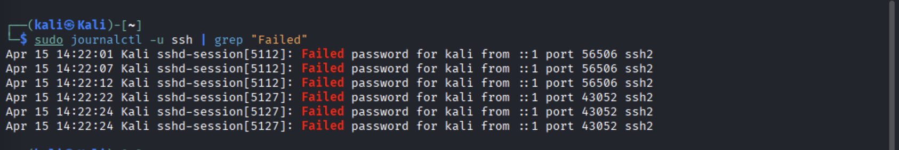
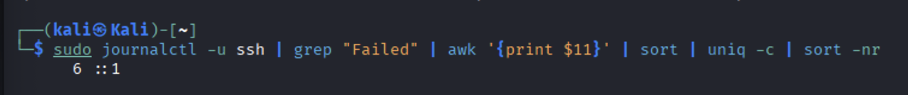

# SOC Alert Investigation — Brute Force Login Detection

## Overview

This project documents a simulated SOC investigation into suspicious SSH login activity on a Linux system. The investigation follows a real-world Tier 1 analyst workflow: alert triage, log analysis, pattern identification, escalation decision, and remediation recommendation.

All activity was generated in a controlled lab environment.

---

## Scenario

A monitoring alert fired on repeated failed SSH authentication attempts targeting a Linux web server. The goal was to determine whether the activity represented a brute force attack, identify the source, assess the risk, and document findings.

---

## Tools Used

| Tool | Purpose |
|---|---|
| Linux auth logs (`auth.log` / `journalctl`) | Raw log source |
| `grep`, `awk`, `sort`, `uniq` | Command-line log parsing |
| Splunk SPL | Alert queries, threshold detection, lateral movement identification |

---

## Investigation Workflow

### 1. Alert Triage
Received alert for multiple failed SSH login attempts. Confirmed alert was not a false positive by reviewing raw log volume and timestamps.

### 2. Log Collection
Pulled authentication logs from the target system:

```bash
grep "Failed password" auth.log
grep "Failed password" auth.log | awk '{print $11}' | sort | uniq -c | sort -nr
sudo journalctl -u ssh | grep "Failed" | awk '{print $11}' | sort | uniq -c | sort -nr
```

Sample log file included: [`sample-auth.log`](./sample-auth.log)

### 3. Pattern Identification

- **12 failed login attempts** detected within a 2-minute window
- Attempts targeted multiple usernames: `admin`, `root`, `ubuntu`, `pi`, `test`, `guest`
- All failures originated from a single source IP: `192.168.1.105`
- One successful login observed from a separate trusted IP (`10.0.0.5`) — confirmed legitimate

### 4. Splunk Detection

Built SPL queries to automate detection at scale. See [`splunk-queries.md`](./splunk-queries.md) for full query reference.

Key detections built:
- Failed login threshold alert (>10 attempts in 5 minutes)
- Multiple usernames from same IP (lateral movement indicator)
- Successful login following multiple failures (potential compromise indicator)

### 5. Escalation Decision

Activity confirmed as brute force behavior. Escalated to Tier 2 with full documentation. No successful unauthorized access confirmed.

---

## Findings

| Indicator | Detail |
|---|---|
| Attack Type | Brute Force — SSH |
| Source IP | 192.168.1.105 |
| Targeted Usernames | admin, root, ubuntu, pi, test, guest |
| Attempts | 12 failed within ~2 minutes |
| Outcome | No unauthorized access — attack unsuccessful |

---

## MITRE ATT&CK Mapping

| Technique | ID |
|---|---|
| Brute Force | T1110 |
| Valid Accounts (monitoring) | T1078 |

---

## Recommendations

- Implement account lockout after 5 failed login attempts
- Enable MFA on all SSH-accessible systems
- Restrict SSH access by IP allowlist where possible
- Set automated Splunk alert for threshold-based failed login detection
- Block `192.168.1.105` at the firewall level pending further investigation

---

## Screenshots




---

## Conclusion

The observed activity is consistent with a brute force attack targeting common service accounts via SSH. The attack was unsuccessful, but without proper monitoring and lockout controls, this pattern could lead to unauthorized system access. This investigation demonstrates a repeatable Tier 1 triage workflow applicable to real SOC environments.

---

*Lab environment. All IPs and usernames are simulated.*
